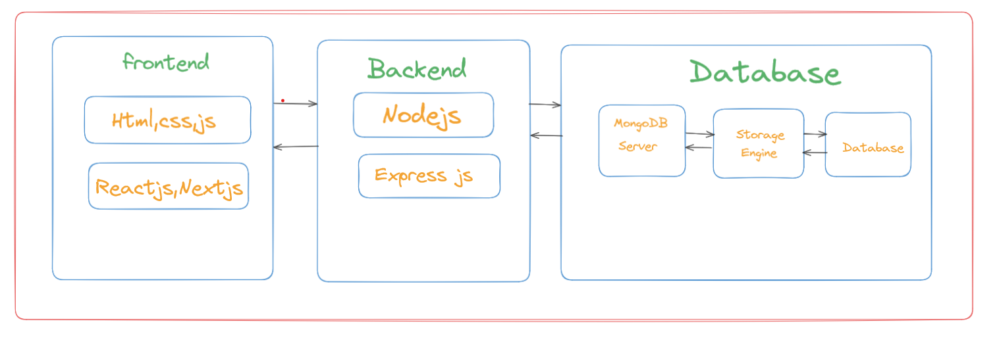

# MongoDB Documentation

## MongoDB Atlas

MongoDB Atlas is a fully managed cloud database service provided by MongoDB. It simplifies the deployment, scaling, and operation of MongoDB databases in the cloud, offering high availability, security, and performance. Atlas supports multiple cloud providers, including AWS, Google Cloud, and Azure, and integrates seamlessly with modern application stacks. Features include automated backups, advanced data analytics, and built-in security measures like encryption and access control.

## MongoDB Compass

MongoDB Compass is a graphical user interface (GUI) tool provided by MongoDB for visualizing, managing, and querying MongoDB databases. It allows users to explore data, build queries with ease, and perform database operations without requiring extensive knowledge of the MongoDB query language.

## MongoDB Shell

The MongoDB Shell (mongosh) is an interactive JavaScript-based command-line interface for MongoDB. It allows users to interact directly with MongoDB databases, perform administrative tasks, and execute queries in real time.

## MongoDB

MongoDB is a popular open-source, NoSQL database management system that stores data in a flexible, document-oriented format called BSON (Binary JSON). It is designed to handle unstructured or semi-structured data, making it highly scalable, performant, and suitable for modern application development. It came from the word "Humongous".

# SQL vs MongoDB

A comparison between SQL and MongoDB to help understand their differences.

| **Aspect**                 | **SQL (Relational Databases)**                               | **MongoDB (NoSQL Database)**                          |
|----------------------------|-------------------------------------------------------------|------------------------------------------------------|
| **Data Model**             | Relational, table-based (rows and columns).                 | Document-oriented, uses BSON (JSON-like) documents.   |
| **Schema**                 | Fixed schema; structure must be defined beforehand.         | Schema-less; allows dynamic fields and flexibility.   |
| **Query Language**         | SQL (Structured Query Language).                            | MongoDB Query Language (MQL), JavaScript-based.       |
| **Relationships**          | Uses joins to relate tables.                                | Embeds or references documents to handle relations.   |
| **Scaling**                | Vertical scaling (adding resources to a single server).     | Horizontal scaling (sharding across servers).         |
| **Transaction Support**    | Full ACID compliance (Atomicity, Consistency, Isolation, Durability). | ACID compliance for multi-document transactions introduced in later versions. |
| **Performance**            | Optimized for structured data with complex queries.         | Faster for unstructured or semi-structured data.      |
| **Use Cases**              | Banking, e-commerce, and systems requiring complex relationships. | Real-time analytics, IoT, and applications with evolving schemas. |
| **Examples of Databases**  | MySQL, PostgreSQL, Oracle DB, Microsoft SQL Server.         | MongoDB, Couchbase, Cassandra.                       |
| **Storage**                | Table-based storage.                                        | Collection of documents stored as key-value pairs.    |
| **Normalization**          | Data is normalized (minimized redundancy).                  | Data is often denormalized for faster access.         |
| **Installation**           | Requires database management software.                      | Standalone or hosted services like MongoDB Atlas.     |

## SQL Database Structure

### Database Tables

#### Students Table
| **Student ID** | **First Name** | **Last Name** | **Date of Birth** | **Email**               |
|----------------|----------------|---------------|-------------------|-------------------------|
| 1              | John           | Doe           | 2000-05-12        | john.doe@example.com    |
| 2              | Jane           | Smith         | 2001-09-20        | jane.smith@example.com  |
| 3              | Alice          | Johnson       | 1999-03-15        | alice.johnson@example.com |

#### Subjects Table
| **Subject ID** | **Subject Name**     | **Credits** |
|----------------|----------------------|-------------|
| 101            | Mathematics          | 4           |
| 102            | Physics              | 3           |
| 103            | Computer Science     | 4           |

#### Grades Table
| **Grade ID** | **Student ID** | **Subject ID** | **Grade** |
|--------------|----------------|----------------|-----------|
| 1            | 1              | 101            | A         |
| 2            | 1              | 102            | B+        |
| 3            | 2              | 103            | A-        |
| 4            | 3              | 101            | B         |
| 5            | 3              | 103            | A         |

## MongoDB Data Example

Below is an example of how student data can be structured in MongoDB with embedded documents for subjects and grades.

```json
[
  {
    "_id": "unique_id_1",
    "first_name": "John",
    "last_name": "Doe",
    "date_of_birth": "2000-05-12",
    "email": "john.doe@example.com",
    "subjects": [
      {
        "subject_id": "unique_subject_id_1",
        "subject_name": "Mathematics",
        "credits": 4,
        "grade": "A"
      },
      {
        "subject_id": "unique_subject_id_2",
        "subject_name": "Physics",
        "credits": 3,
        "grade": "B+"
      }
    ]
  },
  {
    "_id": "unique_id_2",
    "first_name": "Jane",
    "last_name": "Smith",
    "date_of_birth": "2001-09-20",
    "email": "jane.smith@example.com",
    "subjects": [
      {
        "subject_id": "unique_subject_id_3",
        "subject_name": "Computer Science",
        "credits": 4,
        "grade": "A-"
      }
    ]
  },
  {
    "_id": "unique_id_3",
    "first_name": "Alice",
    "last_name": "Johnson",
    "date_of_birth": "1999-03-15",
    "email": "alice.johnson@example.com",
    "subjects": [
      {
        "subject_id": "unique_subject_id_1",
        "subject_name": "Mathematics",
        "credits": 4,
        "grade": "B"
      }
    ]
  }
]

```

# Key Features of MongoDB

## 1. Flexible Schema Design
- **Schema-less**: MongoDB allows documents within the same collection to have different structures, which gives flexibility to handle evolving data models.
- **Rapid Development**: With dynamic schemas, developers can quickly iterate and change the structure of their data without the need for migrations.
- **Supports Complex Data Types**: MongoDB natively supports arrays, embedded documents, and other complex data types, making it ideal for hierarchical data.

## 2. Scalability and Performance
- **Horizontal Scaling**: MongoDB can scale across multiple servers using sharding, distributing data across machines to handle large-scale applications.
- **High Throughput**: MongoDB offers high performance for both read and write operations, thanks to its efficient indexing and in-memory storage engine.
- **Auto-sharding and Load Balancing**: MongoDB automatically balances data across clusters, optimizing resource usage and ensuring high availability for large datasets.

## 3. Document-Oriented Storage
- **BSON Format**: MongoDB stores data in BSON (Binary JSON), which allows for richer, more complex data types than traditional relational databases.
- **Natural Data Modeling**: The document model aligns closely with how developers think about data, making it intuitive to work with.
- **Embedded Data**: Related data can be embedded within a single document, reducing the need for joins and improving read performance.

## 4. Dynamic Queries
- **Rich Query Language**: MongoDB supports a powerful query language, allowing developers to perform complex queries on data, including deep document searches.
- **Flexible Filters**: Developers can query by a wide variety of conditions, including range queries, regular expressions, and geospatial data.
- **Real-time Querying**: MongoDB is designed to handle real-time queries efficiently, making it ideal for interactive applications.

## 5. Aggregation Framework
- **Data Transformation**: MongoDB’s aggregation framework allows you to transform data and perform operations like filtering, grouping, and sorting within the database.
- **Multiple Stages**: The framework supports a pipeline of stages, where each stage performs a specific transformation on the data, improving performance.
- **Powerful Operations**: It supports operations such as `$group`, `$match`, `$sort`, and `$project`, enabling complex data analysis directly in the database.

## 6. Open Source and Community
- **Free and Open Source**: MongoDB is released under the SSPL (Server Side Public License), making it open-source and accessible to developers and organizations.
- **Active Community**: MongoDB has a large and active community of developers, providing open forums, guides, and solutions to common problems.
- **Extensive Documentation**: MongoDB offers comprehensive documentation, tutorials, and a wide range of community resources, making it easy for newcomers to learn and integrate MongoDB.


# MongoDB Flow Image





# JSON vs BSON: A Comparison

This document provides a comparison between JSON (JavaScript Object Notation) and BSON (Binary JSON), highlighting their differences, advantages, and use cases.

---

## **JSON (JavaScript Object Notation)**

### **Overview**
- JSON is a lightweight, text-based data interchange format.
- It is easy for humans to read and write, and for machines to parse and generate.
- JSON is widely used in web APIs and configuration files.

### **Key Features**
1. **Human-Readable**: Stored as plain text, making it easy to understand and debug.
2. **Interoperability**: Supported across multiple programming languages.
3. **Simple Data Types**: Includes basic types like strings, numbers, arrays, and objects.

### **Example**
```json
{
  "name": "John Doe",
  "age": 30,
  "isEmployed": true,
  "skills": ["JavaScript", "Python", "SQL"]
}

```

# BSON (Binary JSON)

BSON (Binary JSON) is a binary-encoded serialization format used primarily to store documents and make remote procedure calls in MongoDB. It extends JSON's capabilities, providing additional data types and a more efficient storage mechanism.

---

## **Key Features of BSON**

### 1. **Binary Encoding**
- BSON stores data in a compact binary format, making it smaller and faster to process than plain JSON.
- It reduces the overhead of transmitting or storing large datasets.

### 2. **Rich Data Types**
- Supports additional types not available in standard JSON, including:
  - `Date`
  - `Binary`
  - `ObjectId`
  - `Decimal128`
- These types simplify handling complex data in applications.

### 3. **Fast Parsing**
- BSON is optimized for high-speed parsing and encoding/decoding.
- Its structure allows efficient traversal and manipulation, especially in database operations.

### 4. **Efficient Storage**
- BSON is designed for efficient storage, with features like length prefixes for quick access to fields.
- It supports embedded documents and arrays, maintaining the hierarchical structure of data.

---

## **Data Types Supported by BSON**

| **Data Type**   | **Description**                                   |
|------------------|--------------------------------------------------|
| `String`        | UTF-8 encoded string.                            |
| `Integer`       | 32-bit and 64-bit integers for numeric values.    |
| `Date`          | Stores dates in milliseconds since the epoch.    |
| `Binary`        | Stores binary data, such as images or files.     |
| `ObjectId`      | Unique identifier for documents in MongoDB.      |
| `Decimal128`    | High-precision decimal numbers.                  |
| `Array`         | Stores ordered lists of values.                  |
| `Embedded Doc`  | Nested documents within a parent document.       |
| `Boolean`       | Stores `true` or `false`.                        |

---

## **Example of BSON Structure**

```json
{
  "_id": { "$oid": "unique_id_12345" },
  "name": "Alice Johnson",
  "age": { "$numberInt": "25" },
  "createdAt": { "$date": "2024-11-23T10:15:30Z" },
  "skills": ["JavaScript", "Python", "MongoDB"],
  "profilePicture": { "$binary": "binary_data", "$type": "00" }
}

```

## Download Links

Here are some of the download links

[MongoDB](https://www.mongodb.com/try/download/community)


[MongoDB Shell](https://www.mongodb.com/try/download/shell)


[MongoDB Database tools](https://www.mongodb.com/try/download/database-tools)


## commands

To check the  MongoDB version

```bash
  mongod --version
```

To start mongoDB Server

```bash
  mongosh
```


## Viewing Databases

```javascript

show dbs;
```

## Alternative command to list all databases

```javascript

show databases;
```

## Switch to a specific database (or create it if it doesn't exist)

```javascript

use databasename;
```

- This can also create a new database .
- If database is not present it will create a new database.
- If there are no collections it will not show.


## Drop the current database

```javascript

db.dropDatabase();
```

## Show all collections in the current database

```javascript

show collections;
```

## Create a new collection

```javascript

db.createCollection("collection-name");
```

## Drop a specific collection

```javascript

db.collectionName.drop();
```

## Insert one document into a collection

```javascript

db.collectionName.insertOne({
    field1: value1,
    field2: value2
});
```

## Insert multiple documents into a collection

```javascript

db.collectionName.insertMany([
    {
        field1: value1,
        field2: value2
    },
    {
        field1: value1,
        field2: value2
    }
]);

```

## Insert multiple documents in an unordered manner

```javascript

db.collectionName.insertMany([
    { field1: value1,
     field2: value2 },
    { field1: value1, 
    field2: value2 }
], { ordered: false });

```

## Case Sensitivity in MongoDB

### Below two commands are different as the first command will  insert the document in Products collection and the second command will insert the document in the products collection.

### Note : Products collection and products collection are different.

```javascript

db.Products.insertOne({
    field1: value1,
    field2: value2
});
```

```javascript

db.products.insertOne({
    field1: value1,
    field2: value2
});
```

## Database tools basic commands  

### Importing an Expoting commands.

### Importing Data

- Open new command line and use these commands
- These database tools commands works outside database


``` javascipt
mongoimport filename.json -d databasename -c collectionname
```
### Example command

``` javascipt
mongoimport products.json -d shop -c products
```

### Actual Command

```javascript

mongoimport C:\Users\MANASH\OneDrive\Desktop\mongoDB\SampleDocuments/products.json -d shop -c products

```

- If data is in array format use below command 

``` javascipt
mongoimport products.json -d shop -c products --jsonarray

```

### Exporting data

```javascript
mongoexport -d shop -c sales -o E:\mongo\files\sample.json
```

## Read operations in MongoDB

### 1. Reading document in MongoDB

### 2. Comparison Operator

### 3. Logical Operator

### 4. Cursors in MongoDB

### 5. Element Operators


## 1. Reading document in MongoDB 

 ### find() and findOne()

 - Find all documents in the collection

 ``` javascript
 db.collectionname.find();
 ```

 - Find documents based on condition.
 - Find will fetch multiple documents.

 ``` javascript
 db.collectionname.find({key : value});
 ```

 ### Find Single document

 ``` javascript
 db.collectionname.findOne({field : value});

 ```


